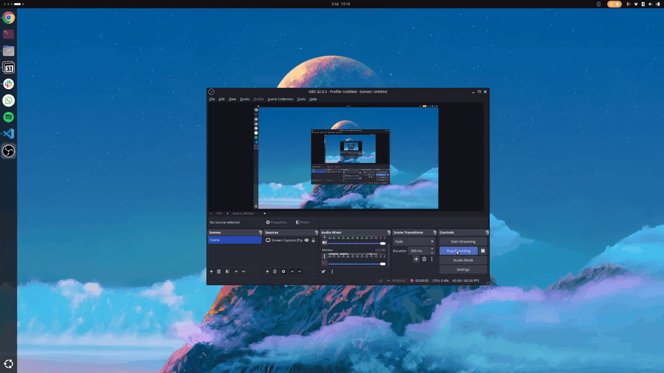

# GNOME Tray Toggle

A GNOME Shell extension that adds a toggle button to hide/show system tray application icons with smooth animations.


## Features

- 🎯 **Toggle Button** - Adds a convenient button to your top panel
- ✨ **Smooth Animations** - Icons slide in/out with elegant fade effects
- 🎨 **Yaru Icons** - Uses native Ubuntu/GNOME icons that match your theme
- 🔒 **Smart Filtering** - Only hides app tray icons, keeps system icons visible
- 🚀 **Lightweight** - Minimal resource usage, clean code

## Demo



**Tray Visible:**


**Tray Hidden:**


## Installation

### From Source (Manual Installation)

1. Clone the repository:
```bash
git clone https://github.com/szamski/gnome-tray-toggle.git
cd gnome-tray-toggle
```

2. Install the extension:
```bash
make install
```

3. Restart GNOME Shell:
   - **X11**: Press `Alt+F2`, type `r`, press Enter
   - **Wayland**: Log out and log back in

4. Enable the extension:
```bash
gnome-extensions enable tray-toggle@maciek
```

### From GNOME Extensions Website

Visit [extensions.gnome.org](https://extensions.gnome.org/) and search for "Tray Toggle" (coming soon).

## Usage

1. Look for the toggle icon (→) in your top panel, to the right of the system menu
2. Click the icon to hide application tray icons
3. Icon changes to (←) when tray is hidden
4. Click again to show the icons

**Keyboard Shortcut:** Not implemented yet (planned feature)

## Compatibility

- **GNOME Shell:** 47, 48, 49
- **Ubuntu:** 25.10+ (Oracular Oriole)
- **Tested on:** Ubuntu 25.10 with Wayland

## Configuration

Currently, the extension works out of the box with no configuration needed. Future versions may include:
- Customizable keyboard shortcuts
- Animation speed settings
- Icon selection options

## Development

### Project Structure

```
gnome-tray-toggle/
├── extension.js       # Main extension code
├── metadata.json      # Extension metadata
├── stylesheet.css     # Custom styles
├── README.md          # This file
├── LICENSE            # GPL-3.0 license
├── Makefile          # Build and install scripts
└── screenshots/       # Screenshots for documentation
```

### Building

```bash
# Install to local extensions directory
make install

# Create a distributable zip file
make zip

# Clean build artifacts
make clean
```

### Contributing

Contributions are welcome! Please feel free to submit a Pull Request.

1. Fork the repository
2. Create your feature branch (`git checkout -b feature/amazing-feature`)
3. Commit your changes (`git commit -m 'Add some amazing feature'`)
4. Push to the branch (`git push origin feature/amazing-feature`)
5. Open a Pull Request

## Troubleshooting

### Extension doesn't appear after installation

- Make sure you've restarted GNOME Shell (logout/login on Wayland)
- Check if the extension is enabled: `gnome-extensions list --enabled`
- View logs: `journalctl -f -o cat /usr/bin/gnome-shell`

### Icons don't hide properly

- Ensure you're running GNOME Shell 47 or later
- Check that AppIndicator extension is enabled: `gnome-extensions list --enabled | grep appindicator`

### Animation issues

The extension uses Clutter animations. If you experience issues:
- Check if animations are enabled in your system settings
- Try disabling other panel extensions that might conflict

## License

This project is licensed under the GNU General Public License v3.0 - see the [LICENSE](LICENSE) file for details.

## Credits

- Icon animations inspired by Waybar's tray behavior on Hyprland
- Uses Yaru icon theme by Ubuntu Design Team
- Built with GNOME Shell Extension API

## Changelog

### Version 1.0.0 (2026-02-03)
- Initial release
- Toggle button with smooth slide animations
- Smart filtering (hides only app icons, not system icons)
- Support for GNOME Shell 47-49
